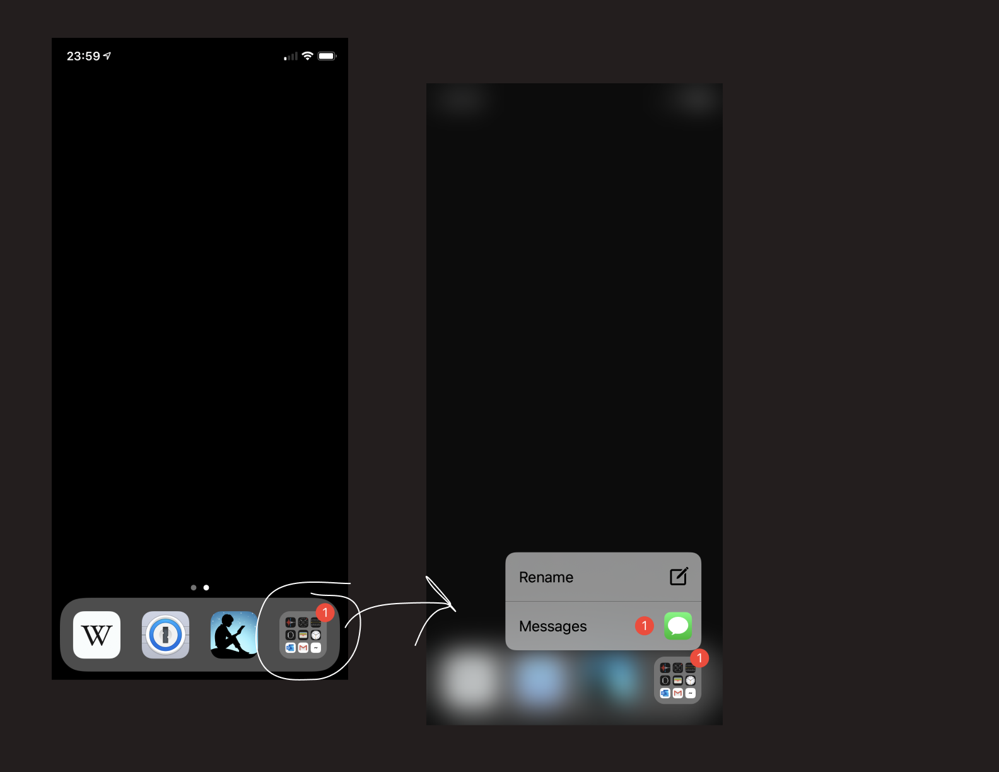

+++
title = "Personal Computer, Vending Machine"
description = "What is a reading network?"
date = 2017-10-20
weight = 0
draft = false
aliases = []
in_search_index = true
template = "page.html"
[taxonomies]
+++

In the last month or so, at least eight people have asked me why I arrange my device the way I do. I’ll take some time to describe my phone and how I use it, and why I think my personal arrangement is a good idea in general. This shouldn’t take very long.

This is a contemporary personal computer:

As they currrently exist, I often describe phones as "basically vending machines".

Think about it: Small rectangles encased in glass, displaying an array of colorful and beautiful packages, each promising bite-sized hits of pleasure/dopamine, each “cheaply” priced (and in many cases, free) — this is a vending machine.

This is a contemporary personal computer.

I personally do not believe vending machines orient people towards better living. I have personally never been satiated by food that comes out of a vending machine.

While we still operate about the assumption that a small glass brick is the best focal point/lens through which we experience digital products and infrastructure, I think there are a small set of actions we can take to make our devices less candy-like, more boring and utilitarian, and less conducive towards being manipulated by the corporations that seek to make their products the focal point of your life.

This is my phone, an Apple product running iOS:

There are only three icons on the screen. One icon represents Kindle, a digital book service Amazon operates. The next icon represents 1Password, a password-consolidation/generation/obscuring application. The last icon is a folder, which houses the other applications on my phone.

At this point, my phone is no longer a vending machine — this is a good thing.

Notifications for Kindle and 1Password are turned off, and the few in-folder applications that I allow to display visual notifications are accessible through 3D-Touch or Search, like this:

Accessing “apps that actually require you to display visual notifications” is more efficient, and doesn’t tempt you with a grid of colorful buttons. In this way, I’ve been able to construct a purposeful arrangement of tools and social nets that isn’t as addicting as it can be.

One can run their phone in greyscale to further minimize the attention drawn to notifications and other attention-drawing effects.

What is now arranged is a less-distracting personal computing experience.
