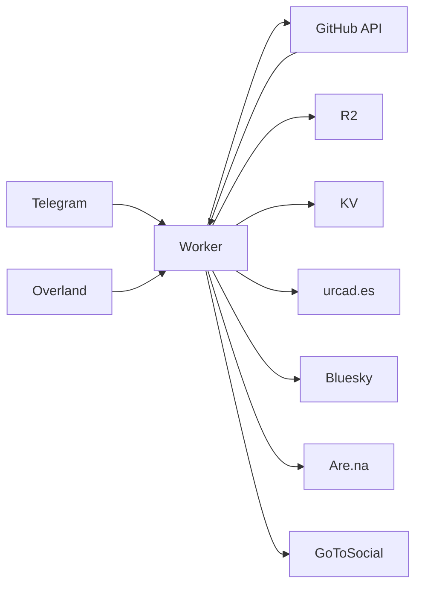

# urcad.es

Personal website and blog for Édouard Urcades, built with [Astro](https://astro.build) and served as a [Cloudflare Worker](https://workers.cloudflare.com). A unified Worker delivers the static site and handles Telegram publishing plus Overland location tracking.

## Development

```bash
# Start development server
npm run dev

# Build for production (includes TypeScript checking)
npm run build

# Preview production build locally
npm run preview

# Worker commands
npm run worker:dev      # Local Worker dev (serves dist/ + API routes)
npm run deploy         # Build + deploy Worker
npm run worker:tail    # Stream Worker logs
```

The build command runs `astro check` for type validation before building.

## Content Collections

The site uses Astro's Content Collections API with three collections defined in `src/content.config.ts`:

| Collection | Location | Description |
|------------|----------|-------------|
| `writing` | `src/content/writing/` | Published blog posts |
| `drafts` | `src/content/drafts/` | Draft posts (visible only in dev mode) |
| `work` | `src/content/work/` | Portfolio items |

### Post Schema

Writing and draft posts share the same schema:

- `title` (required) - Post title
- `pubDate` (required) - Publication date
- `description` (required) - Short description
- `foregroundColor`, `foregroundColorDark` (optional) - Custom text colors
- `backgroundColor`, `backgroundColorDark` (optional) - Custom background colors
- `tags` (optional) - Array of strings (e.g., `["stream"]`)
- `media` (optional) - Array of media objects with `url`, `type`, and `alt`
- `source` (optional) - How the post was created (`sms`, `web`, `cli`, `telegram`)

Files prefixed with `_` are excluded from collections.

### Dynamic Routes

- `/writing/[id]` - Published posts via `src/pages/writing/[id].astro`
- `/drafts/[id]` - Draft posts via `src/pages/drafts/[id].astro` (dev only)
- `/work/[id]` - Portfolio items via `src/pages/work/[id].astro`

## Deployment

Deploy with `npm run deploy` (builds Astro, then deploys the Worker via `wrangler deploy`). The Worker serves the static site from `dist/` and handles API routes.

- **Build command**: `npm run build`
- **Output directory**: `dist/`
- **Custom domain**: `https://www.urcad.es`

Secrets are configured via `npx wrangler secret put <NAME>` or `scripts/set-secrets.sh`.

## Unified Worker

A single Cloudflare Worker serves the site and handles:

- **Static assets** — Astro build from `dist/` (run_worker_first)
- **Telegram publishing** — `POST /api/telegram` webhook → GitHub API → R2 → cross-post to Bluesky, Are.na, GoToSocial
- **Location tracking** — `POST /api/location` (Overland iOS) and `GET /api/location/current` (displayed on about page)



### Telegram Flow

1. Send a message (text, photo, or video) to the Telegram bot
2. Worker validates user against whitelist
3. Media → R2 under `stream/YYMMDD/`
4. Content committed to GitHub (daily digest `YYMMDD.md`)
5. Deploy triggers rebuild and redeploy

**Whitelisted users** → `src/content/writing/`; **non-whitelisted** → `src/content/drafts/`. Daily digests use `~` as entry separator; media URLs: `https://media.urcad.es/stream/YYMMDD/filename`.

Configuration: `wrangler.toml` at repo root. Secrets: `scripts/set-secrets.sh` or `npx wrangler secret put <NAME>`.

## Additional Features

- **RSS feed** at `/rss.xml` (excludes drafts, filters stream posts by date)
- **Custom layouts**: `Base.astro`, `Writing.astro`, `Work.astro`
- **Per-post theming** via frontmatter color properties
- **Prefetching** enabled for all internal links
- **Location display** on about page via Overland + Nominatim geocoding

---

```
"Everybody deserves a new computer."
   /
 /\_/\
( o.o )
 > ^ <
```
