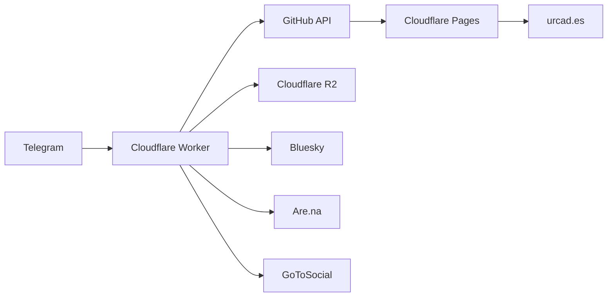

# urcad.es

Personal website and blog for Édouard Urcades, built with [Astro](https://astro.build) and deployed on [Cloudflare Pages](https://pages.cloudflare.com).

## Development

```bash
# Start development server
npm run dev

# Build for production (includes TypeScript checking)
npm run build

# Preview production build locally
npm run preview
```

The build command runs `astro check` for type validation before building.

## Content Collections

The site uses Astro's Content Collections API with three collections defined in `src/content.config.ts`:

| Collection | Location | Description |
|------------|----------|-------------|
| `writing` | `src/content/writing/` | Published blog posts |
| `drafts` | `src/content/drafts/` | Draft posts (visible only in dev mode) |
| `work` | `src/content/work/` | Portfolio items |

### Post Schema

Writing and draft posts share the same schema:

- `title` (required) - Post title
- `pubDate` (required) - Publication date
- `description` (required) - Short description
- `foregroundColor`, `foregroundColorDark` (optional) - Custom text colors
- `backgroundColor`, `backgroundColorDark` (optional) - Custom background colors
- `tags` (optional) - Array of strings (e.g., `["stream"]`)
- `media` (optional) - Array of media objects with `url`, `type`, and `alt`
- `source` (optional) - How the post was created (`sms`, `web`, `cli`, `telegram`)

Files prefixed with `_` are excluded from collections.

### Dynamic Routes

- `/writing/[id]` - Published posts via `src/pages/writing/[id].astro`
- `/drafts/[id]` - Draft posts via `src/pages/drafts/[id].astro` (dev only)
- `/work/[id]` - Portfolio items via `src/pages/work/[id].astro`

## Deployment

Cloudflare Pages auto-deploys on push to `main`. No manual deployment commands needed.

- **Build command**: `npm run build`
- **Output directory**: `dist/`
- **Pages URL**: `urcades.pages.dev`
- **Custom domain**: `https://www.urcad.es`

## Telegram Publishing

A Cloudflare Worker enables publishing posts directly from Telegram. Located in `workers/sms-publisher/`.



### How It Works

1. Send a message (text, photo, or video) to the Telegram bot
2. Worker validates user against whitelist
3. Media files are uploaded to R2 bucket under `stream/YYMMDD/` path
4. Content is committed to GitHub via API
5. Site auto-deploys via Cloudflare Pages
6. Optionally cross-posts to Bluesky, Are.na, and GoToSocial

### Access Control

- **Whitelisted users** → posts go to `src/content/writing/` (published)
- **Non-whitelisted users** → posts go to `src/content/drafts/` (dev only)

### Daily Digest Format

Posts are aggregated into daily files named `YYMMDD.md`. Each entry includes a timestamp, and multiple entries are separated by `~`. Media URLs point to `https://media.urcad.es/stream/YYMMDD/filename`.

For detailed setup instructions, see [`workers/sms-publisher/SETUP.md`](workers/sms-publisher/SETUP.md).

## Additional Features

- **RSS feed** at `/rss.xml` (excludes drafts, filters stream posts by date)
- **Custom layouts**: `Base.astro`, `Writing.astro`, `Work.astro`
- **Per-post theming** via frontmatter color properties
- **Prefetching** enabled for all internal links

---

```
"Everybody deserves a new computer."
   /
 /\_/\
( o.o )
 > ^ <
```
