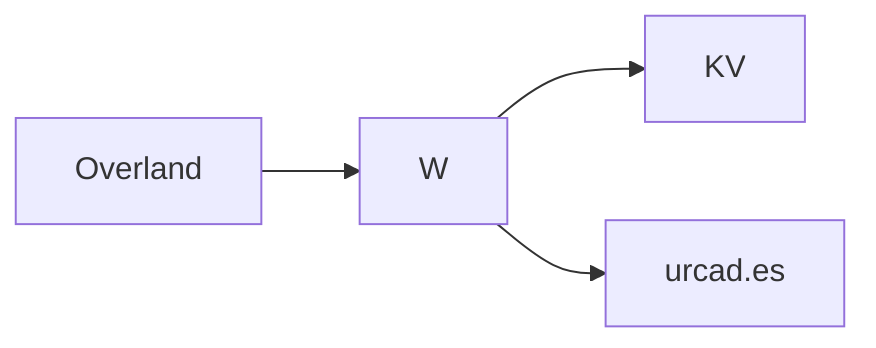

# urcad.es

Personal website and blog for Édouard Urcades, built with [Astro](https://astro.build) and served as a [Cloudflare Worker](https://workers.cloudflare.com). A unified Worker delivers the static site and handles Overland location tracking; local publishing is handled by deterministic repo scripts that can be called by Apple Messages, email, or other private capture bridges.

## Development

```bash
# Start development server
npm run dev

# Build for production (includes TypeScript checking)
npm run build

# Preview production build locally
npm run preview

# Local publishing
npm run publish:stream -- --event /path/to/event.json
npm run publish:stream:run -- --event /path/to/event.json --result-json /path/to/result.json
npm run test:publish-stream

# Worker commands
npm run worker:dev      # Local Worker dev (serves dist/ + API routes)
npm run deploy         # Build + deploy Worker
npm run worker:tail    # Stream Worker logs
```

The build command runs `astro check` for type validation before building.

## Content Collections

The site uses Astro's Content Collections API with three collections defined in `src/content.config.ts`:

| Collection | Location | Description |
|------------|----------|-------------|
| `writing` | `src/content/writing/` | Published blog posts |
| `drafts` | `src/content/drafts/` | Draft posts (visible only in dev mode) |
| `work` | `src/content/work/` | Portfolio items |

### Post Schema

Writing and draft posts share the same schema:

- `title` (required) - Post title
- `pubDate` (required) - Publication date
- `description` (required) - Short description
- `foregroundColor`, `foregroundColorDark` (optional) - Custom text colors
- `backgroundColor`, `backgroundColorDark` (optional) - Custom background colors
- `tags` (optional) - Array of strings (e.g., `["stream"]`)
- `media` (optional) - Array of media objects with `url`, `type`, and `alt`
- `source` (optional) - How the post was created (`sms`, `web`, `cli`, `telegram`, `imessage`, `email`)

Files prefixed with `_` are excluded from collections.

### Dynamic Routes

- `/writing/[id]` - Published posts via `src/pages/writing/[id].astro`
- `/drafts/[id]` - Draft posts via `src/pages/drafts/[id].astro` (dev only)
- `/work/[id]` - Portfolio items via `src/pages/work/[id].astro`

## Deployment

Deploy with `npm run deploy` (builds Astro, then deploys the Worker via `wrangler deploy`). The Worker serves the static site from `dist/` and handles API routes.

- **Build command**: `npm run build`
- **Output directory**: `dist/`
- **Custom domain**: `https://www.urcad.es`

The Worker requires only `OVERLAND_TOKEN`, configured via `npx wrangler secret put OVERLAND_TOKEN` or `scripts/set-secrets.sh`. Local publishing credentials are stored outside the repo; see [Local Stream Publishing](#local-stream-publishing).

## Unified Worker

A single Cloudflare Worker serves the site and handles:

- **Static assets** — Astro build from `dist/` (run_worker_first)
- **Location tracking** — `POST /api/location` (Overland iOS) and `GET /api/location/current` (displayed on about page)


```mermaid
flowchart LR
    OV[Overland] --> W
    W --> KV[KV]
    W --> Site[urcad.es]
```

Configuration lives in `wrangler.toml` at the repo root. Historical stream posts may still use `source: "telegram"` in frontmatter for provenance, but Telegram is no longer an active Worker publishing surface.

## Local Stream Publishing

The local publisher is the canonical bridge target for Apple Messages, email, or any other private capture surface that can produce normalized JSON. It writes markdown locally, uses Wrangler to upload media to the existing R2 bucket, commits/pushes the generated content, deploys the Worker assets, verifies the public URL, and mirrors the post to configured social targets.

```bash
npm run publish:stream:run -- --event /path/to/event.json --result-json /path/to/result.json
npm run publish:stream -- --event /path/to/event.json
```

Use `publish:stream:run` for the host-agent flow. It publishes the event, fast-forwards the current branch from `origin`, runs tests/build, commits only the generated content file, pushes the current branch, deploys the already-built Worker assets, verifies the public URL, cross-posts to configured social targets, writes a machine-readable result JSON file, and prints JSON for human/manual use. Use `publish:stream` for lower-level debugging.

Event JSON:

```json
{
  "id": "stable-message-or-bridge-id",
  "source": "imessage",
  "sender": "optional sender identifier",
  "receivedAt": "2026-05-30T12:34:56.000Z",
  "text": "🎡 body text",
  "media": [{ "path": "/absolute/path.jpg", "mimeType": "image/jpeg", "alt": "" }]
}
```

Text must start with `🎡`, `publish:`, or `draft:`. `🎡` is the human-facing publish marker and is stripped from the generated markdown. `🎡` and `publish:` write/append `src/content/writing/YYMMDD.md`; `draft:` writes/appends `src/content/drafts/YYMMDD.md`. Missing prefixes fail without writing content.

Media is uploaded with `npx wrangler r2 object put urcades/stream/YYMMDD/<safe-file-name> --file <path> --content-type <mime> --remote` and referenced as `https://media.urcad.es/stream/YYMMDD/<safe-file-name>`. Use `--dry-run` to inspect planned output and R2 keys without writing files, committing, pushing, deploying, uploading media, or cross-posting. Bridge integrations should parse `--result-json` first because stdout can include npm or subprocess output before the final JSON.

### Local Cross-posting

After a published writing post is deployed and its public URL returns 200, `publish:stream:run` mirrors the post to configured social targets. Cross-post failures are non-fatal: the blog publish remains successful, and `crossposts` in the result JSON records per-target status.

Local cross-post credentials are stored outside the repo. Store them at `~/Library/Application Support/urcad.es/social-crosspost.json` with mode `600`:

```json
{
  "BLUESKY_HANDLE": "example.bsky.social",
  "BLUESKY_APP_PASSWORD": "app-password",
  "BLUESKY_PDS_URL": "https://bsky.social/xrpc",
  "ARENA_ACCESS_TOKEN": "arena-token",
  "ARENA_CHANNEL_SLUG": "channel-slug",
  "GOTOSOCIAL_URL": "https://social.example",
  "GOTOSOCIAL_ACCESS_TOKEN": "gotosocial-token"
}
```

`BLUESKY_PDS_URL` is optional. The doctor checks both Cloudflare auth and this social config:

```bash
npm run publish:stream:doctor
```

## Additional Features

- **RSS feed** at `/rss.xml` (excludes drafts, filters stream posts by date)
- **Custom layouts**: `Base.astro`, `Writing.astro`, `Work.astro`
- **Per-post theming** via frontmatter color properties
- **Prefetching** enabled for all internal links
- **Location display** on about page via Overland + Nominatim geocoding

---

```
"Everybody deserves a new computer."
   /
 /\_/\
( o.o )
 > ^ <
```
