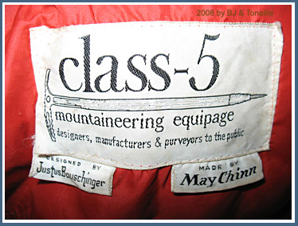
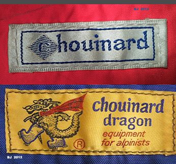
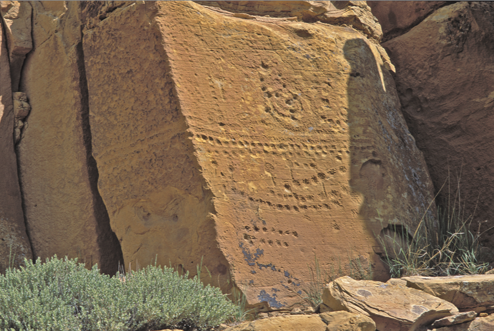
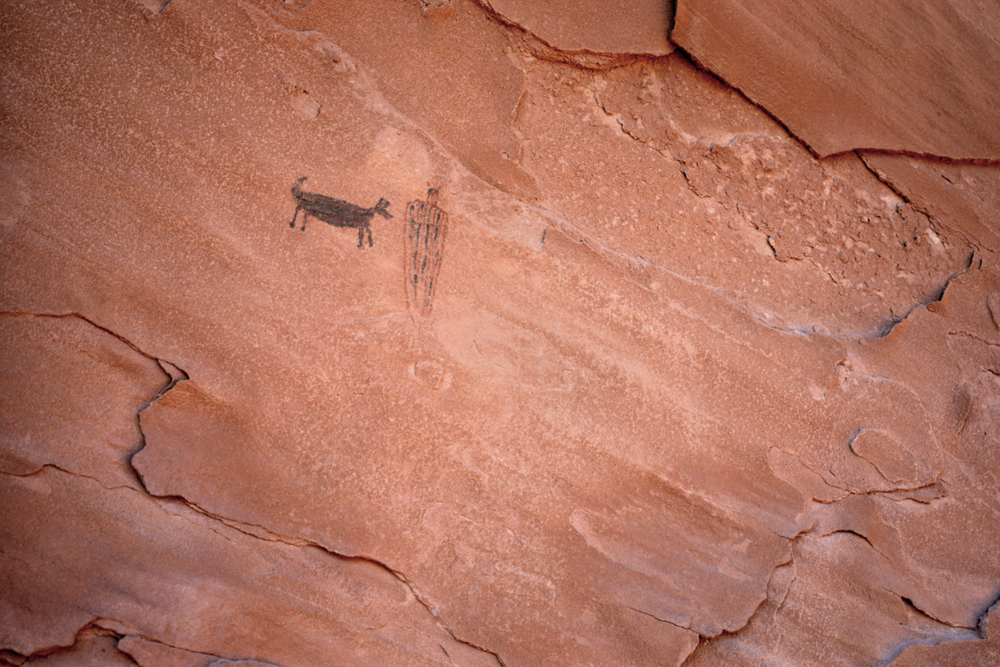
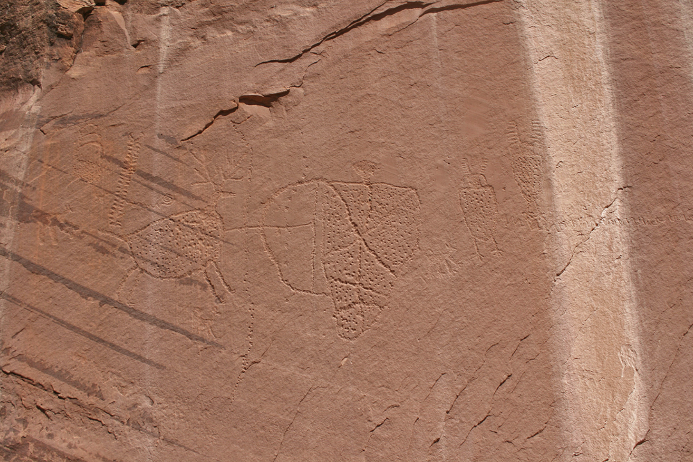
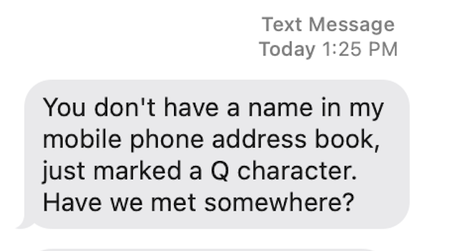
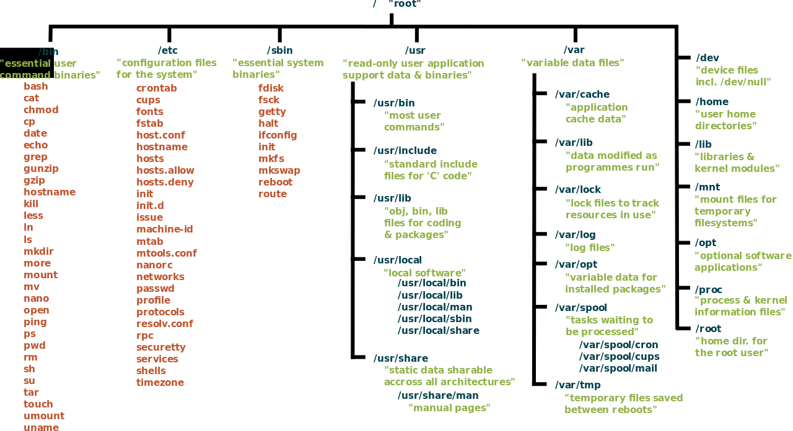
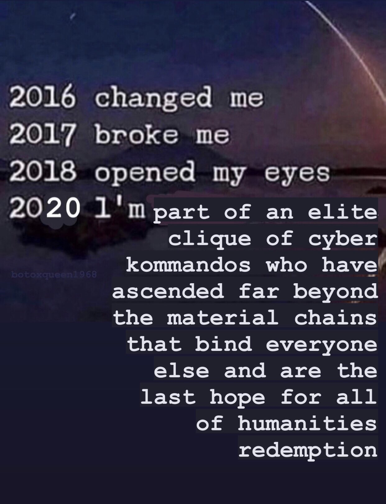
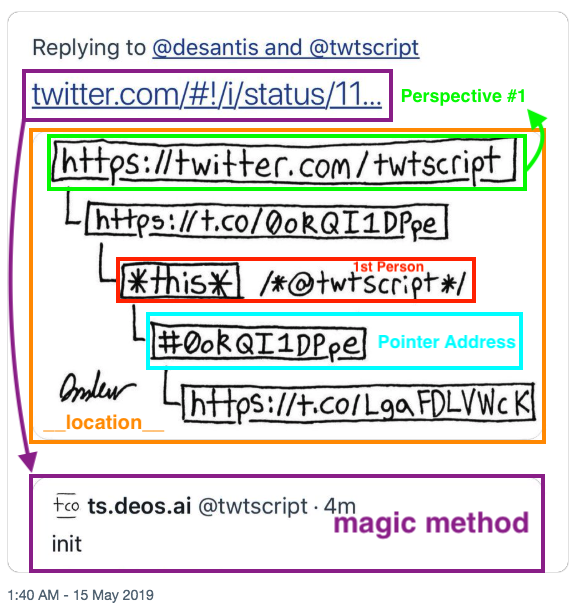
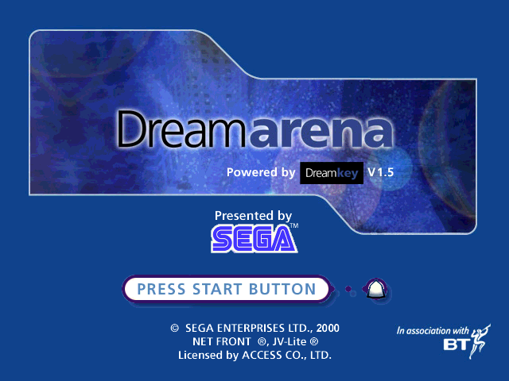

I’ve had a few daydreams over the past weekend:

Of time spent in Arizona, reading trail maps, tomes of North American mushroom, and nursery pamphlets. Of hunting with my dad and his dad and my uncles. Of the prairies and mountains that orbit the Mogollon Rim. I sort of want to get back into being “Really Outdoorsy”, but New York City isn’t the best place to be that way.

It took me a long time to fully understand why my dad loved the outdoors so much.

I once again remembered I used to have a deep interest in the works of the ancient indigenous people who inhabited my region, who eventually became the Tohono Oʼodham. My next door neighbor/crush in my second childhood home was Tohono Oʼodham, and I learned a lot about her culture and its aesthetics and practices from her father and herself.

Spending time in their home was my first exposure to I'itoi cosmology and the concept of “the man in the maze”, which profoundly affected me. As a child interested in RPGs like Nethack and Final Fantasy 7 (Which she let me borrow) at the time, I remember being entranced by the idea of underworlds, gods in caves, labyrinths, etc.

I’ve retained a lot of the information I absorbed around this time. In retrospect, a lot of still-held theses I have about the ways worlds are constructed probably emanate from this time. Back in Tucson, I still have a worn out copy of a guide to building levels using Unreal Engine. It’s immensely satisfying to be able to connect the dots of my life in retrospect, using supporting material, other people’s memories, books about people and places that had nothing to do with me, etc.

Have you connected your life’s dots recently?

Unrelated, an interesting idea for a novel RPG system: A game in which the stat system itself is the subject of creativity, where stats are alchemically mixed, matched, parametrically related to one another, and hacked in order to overcome challenges in the game’s world, where strength, agility, and constitution are simply not enough to survive. I hear Noita is a game that explores this idea a bit, but I like the idea of situating the locus of growth within a player character itself, rather than in a tool, a weapon, or a held object.

~

Last week, Khalisha and I got on a call to talk about careers, growing in understanding, and identifying the roots of organizational problem areas. I shared some interesting tidbits from this lecture course I attended over the past couple of weeks, and it felt good to relay this information over to someone else who could make use of it.

K and I spoke a little about what it meant to convey the true heart of technology work, what “it is” we’re all collectively coalescing from the ether, and when shorn of all pretense, what “good” technology work actually “is” at the end of the day.

She told me a beautiful story of when she was a lot younger, desiring so much to play a game she didn't own, she took a blank CD-R and inscribed the concept of the game onto the surface of the disk by drawing its title. She was 100% convinced that this was all it took to develop a working game, and when inserted into the drive, magic would happen – The story would unfold before her.

I won’t forget Khalisha’s story for a long time, I think.

~

https://ossx.bandcamp.com/track/underneath-the-stars-ossx-edit

