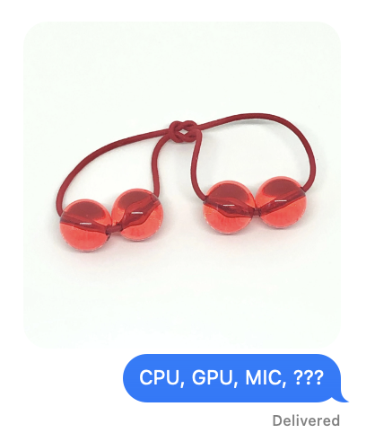
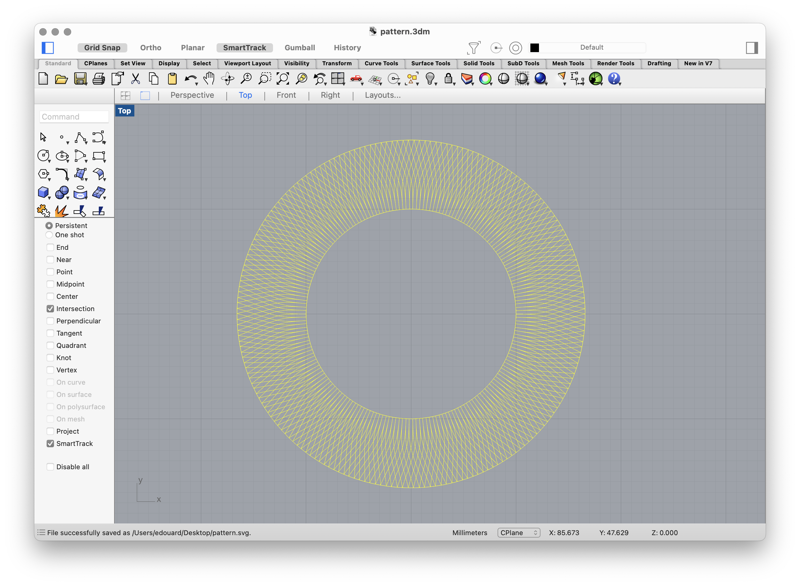
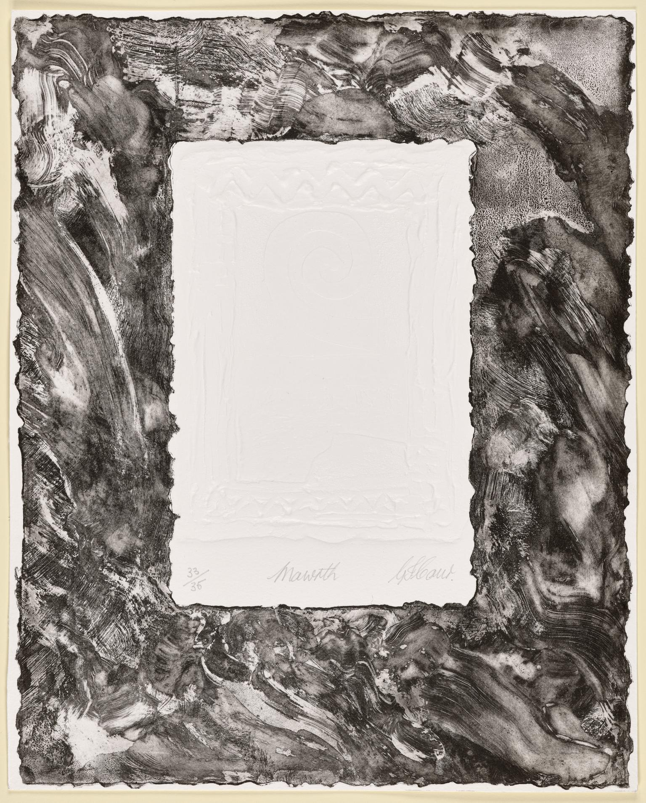
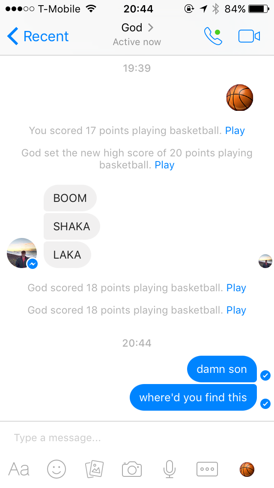
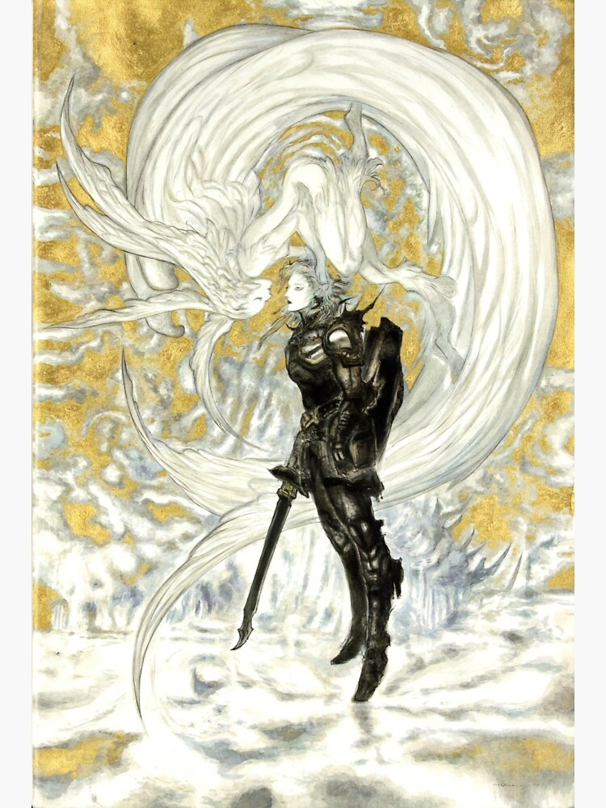

Taking a beat at the top of March to reflect on the prior month.

Slow seasonal ease into milder times. Punctuated with a brief but terrible flu. A brain fog like I've never experienced in my entire life, a handful of existential crises. No art, no reading, no meaningful creative production. Easing out of hibernation. Discarding endless packaging, rupture of routines. Fancy cakes. Sheaves of organic cotton. VStacks. PC memory leak, potentially broken PC. Flower Computers. New technologies, new sights, Apple Vision Pro. Screenshots, snippets, scheming, strategy. Winter 2023 Apple Music Playlist. Onchain Sketchbook. New ethereum address. New ledger. Zero knowledge. work_data_ciim-images_media_..._IMPC01_06_009.jpg, Rosetta. Reformat, factory reset. Rain, a bit of snow. Grey's Anatomy. Red, red, red, red, red, Red, Roses, red more red. Daughters, jobs, money, land, homes, money, land. Digital currencies. Grey's Anatomy Bomb Threat Episode. Reality television, leap year, new music, new mindset, new body.

*Status update:*

I recently made a minor, mostly personal breakthrough on my personal website today. It's a capability I've always wanted for publishing text/pages to the web, and I finally eked out some time to figure it out for myself.

For those unaware, my website is built using a web framework called "Astro". I find this framework appealing because it's simple, it doesn't get in the way of me, and it's basically just django/jekyll but with javascript as the templating/scripting language. This is neat because I basically assemble this thing like I do any ordinary simple site: using html, a bit of css/tailwind styling, and some javascript to loop over things and promote reusability.

The breakthrough I speak of is a relatively simple daisy chain of variables and javascript imports to make optional per-post foreground/background color customization really trivial from the authoring perspective. This capability is important to me for obscure reasons I'm not going to explain in depth, but it has to do with casting text into very particular timbres. Color's one way to do this, but I'd be the first to claim that color barely exists as a meaningful medium for design purposes. So, take it or leave it.

If you check out [the source of this post](https://github.com/urcades/urcad.es/tree/main/src/content/writing), which is written in markdown (Technically, in .mdx), you'll get a sense for how simple my intervention is. Basically, posts will always look great/beautiful in the monochromatic base I've established for most of my site. When the mood hits, I can add four optional fields to my post's front matter to set particular color fields/moods for a post. I think it's great.

Fields for my posts are established by a data model defined in a config file in a content directory in the source files of my website. This config file describes a javascript object comprised of fields of a variety of types which correspond to the fields I can use for my blog posts: title, date, description, slugs, timbre colors, whatever.

Finally, colors included in my blog post's front matter are percolated upwards to the base template that describes the overall shape of my site.

(Author's note: While writing this in a dark mode context, I realized the links looked terrible and spent 20 minutes fiddling with the styling to get it feeling better. There's still a bit of mediation I need to do between how my front matter colors are applied to things like links and code blocks and the like, which tailwind has taken over via its typography plugin. It might be time to get rid of it since I don't really use it "correctly".)

*Aside*

I've made some progress with flower computers in recent times. Enough to feel comfortable setting up a website for a domain I've been sitting on for a while:

https://floral.computer

While this isn't a company yet, it's good to [over-extrapolate the mark most of the time](https://x.com/neogeomancer/status/1648932099796135936):

Anyways,

For anyone's who's bothered to stay aware of my public communications over the years, you've probably heard the term "flower computer" come up once or twice.

It's a bit of an inside joke, but it's a relatively serious idea involving new ways of applying computation to the world in potentially interesting or novel ways. It's an idea that's easily 5+ years in the making, and stars seem to be aligning in recent times for making it relevant/real.

It's neither an AI thing nor a crypto thing. It's not a pivot of interest to the latest hot topic. Flower computers are comprised of ideas yet to be taken to their logical conclusion. Flower computers are a simple idea that no one has built properly, shockingly. Flower computers are inevitable.

This work is a meditation on images and cameras. It's a recipe for turning any object in the world into a general purpose computer. It might lead towards new modes of human perception and being-in-the-world. We'll see.

I don't think it's neccesarily a perfect magnet for capital investment yet, but I am interested in obtaining modest funding to spend more time cultivating the idea, establishing stronger technical roots, making it realer, making it valuable, etc.

If you happen to be reading this and have leads, or want to talk about flower computers, just send me an email or DM me wherever I'm at.

Peace, have a fun March.

