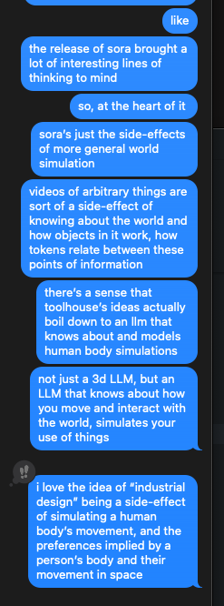

> The premise of our mission isn’t a rejection of standardized goods, but about making custom goods a standardized experience.
>
> Standard goods offer efficient and widespread availability. This is a useful baseline for users to understand what needs they require. Custom goods help build the bridge from what’s available on the market to what a user specifically needs or desires. This can be anything from ergonomics to personal expression. Making custom production accessible to anyone allows products with tailored functionality to establish a new standard in a world of mass manufactured goods.
>
> Optimizing for user needs specific to an individual from a machine that adaptively learns about the user is the highest bar a product experience can offer.

— Toolhouse, [2024 Memo](https://assets-global.website-files.com/655d613ff10226a8c5dc7b18/6593497cf274a1fae8329f76_toolhouse%202024%20memo.pdf)

A few months ago, Toolhouse published a memo that's stuck with me.

Specifically, they offered a point of view on two potential methods of generating hardware:

1. Empty prompts: More or less the existing LLM experience of typing into a blank prompt and generating "something from nothing"
2. Base input model(s): A sort of prototype or "starting place" a hardware-generating LLM might use to inform the overall form of the output

Toolhouse goes on to extrapolate their particular take on how base inputs might evolve or incorporate greater complexity over time. This section of the report is worth reading through in full and contemplating.

While first reading the report, it gave me a shadow of an idea that piggybacks off their conceptual system, or might become embodied in their system at some point.

I want to naively walk through this idea via a few scenarios, some prose written off the cuff, etc.

~

You live in a home in which a totem is installed.

Your totem is a simple machine, a camera module and some method of broadcasting out to a more powerful computer on your local network. Maybe it uses bluetooth or wifi to communicate with your phone, your Mac Studio, or another device. Maybe it has a tiny onboard compute element for making sense of what it sees before broadcasting out to your devices. All in all, it's simple, is probably plugged into the wall directly, and looks beautiful.

Your totem is probably also a local-only device. This sense comes from an idealistic place in which you don't need a corporate LLM to end up with an interesting and personalized output.

Your totem is emblematic of a future wave of so-called "AI Hardware". Your totem is a "particular area" in a private space you have access to most times. It's a space for contemplation or prayer. It's an inert subject you deliver insight on a semi-regular basis. Like a coffee table in the morning, or the small space in front of a space heater your pet cozies up to in winter, your totem circumscribes a place where you know certain events will unfold.

If you've ever seen Snow White (1937), your totem is sorta like the evil queen's magic mirror, or a vanity you bring your troubles to. It can tell you what's most beautiful in the world

You've installed your totem in a space in your home that overlooks the areas you use the most: It has a nearly 360º view of your living room, some parts of your kitchen, and perhaps the hallway that leads to your front door.

Your totem is quietly taking in the surrounding scene, and building up a portrait of how you live your life.

Your totem observes when you struggle to reach a particular spot in your kitchen.

Your totem observes when guests to your home awkwardly bend over to put their shoes back on before leaving.

Your totem observes when you've come back home from the hospital with a broken leg.

Your totem narrativizes your life, extrapolates a bit, and quietly builds you a catalogue of objects that it sends you every month. A personal Sears catalogue of trinkets, tchotchkes, and potentially useful items. These objects complement the existing materiality and color and shape of your home life.

If you have a 3D printer at home, it might be able to print your selections from its catalogue on-prem. If you don't, it can recommend a variety of factories (additive or otherwise) or craftspeople who can build you the items it recommends.

This is a system you opted into a long time ago, knowing full well the extent of its localized surveilance capabilities, and you were OK with it.

After your totem observes you breaking several drinking glasses at a party the other day, the next day it recommends laser-sintered replacements, which can ship nearly ASAP.

After your totem observes you aging poorly over the next 40 years, it gifts you a walking cane that your ego would have never allowed you to buy yourself.

And so on.

While this is a rough series of sentiments, there's an underlying current here of taking what was once a very intentional practice/labor (Industrial Design) and turning it into a side-effect of a camera and the interpretation of digital imagery.

In some sense, images aren't real, in another sense, they're all there is.

Relevant context:

1. [New American Interfaces](/writing/190124/)
2. [Flowers](/writing/231121/)
3. [Dia 1](/writing/240102/)
