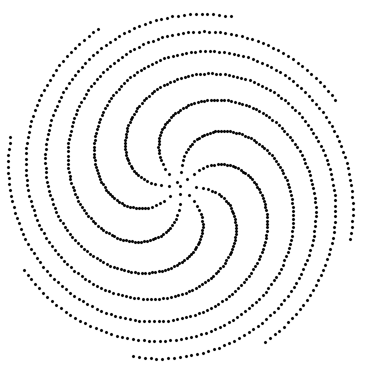

I'm writing this up 26 minutes before it becomes June.

This entry was intended to represent my "top of the month" update, but a lot got in the way of sitting down to write.

If I could characterize May, it was wrestling with schedules, walking in the botanical garden, and dodging beams of sunlight while taking Elle out for a walk.

I received a burst of energy and have begun to make large strides towards making floral computers real, I spent a decent chunk of time chatting to people about the idea, getting a sense for where the magnetic core was the strongest.

The greatest insight I've received along these lines is the notion that this first product I've been feeling around more or less boils down to a consumer camera application.

It feels accessible and distinctly disarming. It's a little off-putting in a sense — cameras are a solved problem, right?

Image capture is a solved problem, right?

One of the distinct bets I'm making is that we've only really scratched the surface of what a camera is capable of.

We're so focused on the side-effect of a flat image being produced that we're missing the greater picture of what's actually happening when the shutter button is squeezed.

Anyways, I don't want to give too much away. This insight and radical simplification of the core "product" led me to feel comfortable producing a [website](https://www.floral.computer) and [social media presence](https://x.com/flowercomputers) for this baby company.

As I get time, I've been busying myself preparing a disgustingly quick and dirty demo/prototype that underlines the core mechanic of the intended social camera app, as well as increasingly reasoned-out framing of the greater picture.

Prompted in part by the YC application, I've been toying with particular framings of this greater picture that involve developing physical cameras, magic mirrors, and new logistical/grid companies. There's a lot here.

My desk is a nest of wires, a mess of paper. Ten more minutes to June...
